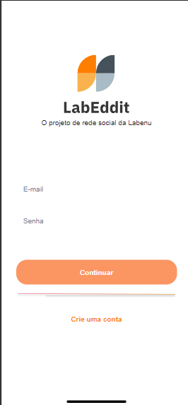
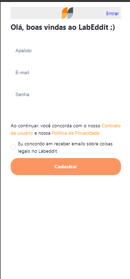
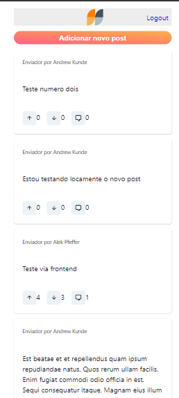
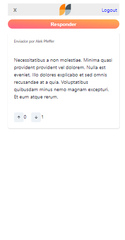

<h1 align="center">Integrador Back</h1>

<p align="center">
  

  

</p>

<p align="center">
  <a href="#dart-sobre">Sobre</a> &#xa0; | &#xa0;
  <a href="#sparkles-funcionalidades">Funcionalidades</a> &#xa0; | &#xa0;
  <a href="#rocket-tecnologias">Tecnologias</a> &#xa0; | &#xa0;
  <a href="#white_check_mark-pré-requisitos">Pré requisitos</a> &#xa0; | &#xa0;
  <a href="#checkered_flag-começando">Começando</a> &#xa0; | &#xa0;
  <a href="#memo-licença">Licença</a> &#xa0; | &#xa0;
  <a href="https://github.com/karinadarc" target="_blank">Autor</a>
</p>

<br>

## :dart: Sobre

O Labook é uma rede social com o objetivo de promover a conexão e interação entre pessoas.

## :sparkles: Funcionalidades

:heavy_check_mark: Respeitar o layout do Figmas;\
:heavy_check_mark: Uso do ReactJS;\
:heavy_check_mark: Deploy no Render;\
:heavy_check_mark: Documentação;\

## Links

### Repositórios

- [Repositório Frontend](https://github.com/karinadarc/projeto-final-integrador-front)
- [Repositório Backend](https://github.com/karinadarc/integrador-back)

### Deploys

- [Deploy - Front End](https://projeto-final-integrador-front.onrender.com)
- [Deploy - Backend Render](https://integrador-back-uk8c.onrender.com)
- [Documentação Postman](https://documenter.getpostman.com/view/28315573/2sA35HXgjA)

> [!IMPORTANT]
> O acesso pode demorar alguns segundos na primeira requisição devido a camada gratuita do render

### Lista de requisitos

- Telas

  - [x] Login
  - [x] Criar Conta
  - [x] Criar post
  - [x] Responder post / Adicionar commentario






## :rocket: Tecnologias

As seguintes ferramentas foram usadas na construção do projeto:

- [Node.js](https://nodejs.org/en/)
- [React Js](https://react.dev/)
- [Vite](https://vitejs.dev/)

## :white_check_mark: Pré requisitos

Antes de começar :checkered_flag:, você precisa ter o [Git](https://git-scm.com) e o [Node](https://nodejs.org/en/) instalados em sua maquina.

## :checkered_flag: Começando

```bash
# Clone este repositório
$ git clone https://github.com/karinadarc/projeto-final-integrador-front

# Entre na pasta
$ cd projeto-final-integrador-front

# Instale as dependências
$ npm install

# Para iniciar o projeto
$ npm run dev

# O app vai inicializar em <http://localhost:5173>
```

## :memo: Licença

Este projeto está sob licença MIT. Veja o arquivo [LICENSE](LICENSE.md) para mais detalhes.

Feito com :heart: por <a href="https://github.com/karinadarc" target="_blank">Karina D&#39;arc Piere</a>

&#xa0;

<a href="#top">Voltar para o topo</a>
